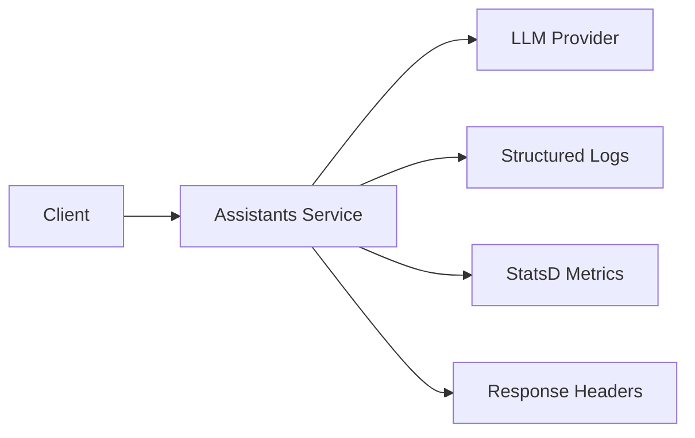

# Observability Guide

**Version**: v1.1.1
**Last Updated**: 2025-01-07

This guide covers logging, metrics, tracing, and monitoring for the Olumi Assistants Service.

---

## Table of Contents

1. [Request ID Tracking](#request-id-tracking)
2. [Structured Logging](#structured-logging)
3. [Metrics & Telemetry](#metrics--telemetry)
4. [Error Monitoring](#error-monitoring)
5. [Performance Monitoring](#performance-monitoring)
6. [Privacy & Redaction](#privacy--redaction)
7. [Dashboards & Alerts](#dashboards--alerts)

---

## Request ID Tracking

### Overview
Every request is assigned a unique UUID v4 identifier that flows through the entire system, enabling end-to-end tracing.

### Request ID Sources
1. **Client-provided**: `X-Request-Id` header from client
2. **Auto-generated**: UUID v4 if not provided

### Request ID Propagation



### Implementation

```typescript
// Incoming request
GET /assist/draft-graph
X-Request-Id: 550e8400-e29b-41d4-a716-446655440000

// Outgoing response
HTTP/1.1 200 OK
X-Request-Id: 550e8400-e29b-41d4-a716-446655440000

// Logs
{
  "request_id": "550e8400-e29b-41d4-a716-446655440000",
  "level": "info",
  "msg": "Request completed",
  "duration_ms": 1234
}

// Error responses
{
  "schema": "error.v1",
  "code": "RATE_LIMITED",
  "request_id": "550e8400-e29b-41d4-a716-446655440000"
}
```

### Configuration
No configuration required - request IDs are always enabled.

---

## Structured Logging

### Log Format
All logs use Pino structured JSON format:

```json
{
  "level": 30,
  "time": 1704677400000,
  "pid": 12345,
  "hostname": "assistants-service-xyz",
  "request_id": "550e8400-e29b-41d4-a716-446655440000",
  "method": "POST",
  "url": "/assist/draft-graph",
  "status": 200,
  "duration_ms": 1234,
  "cost_usd": 0.0015,
  "provider": "openai",
  "model": "gpt-4o-mini",
  "msg": "Request completed"
}
```

### Log Levels
- **Error (50)**: Always logged - system errors, failed requests, exceptions
- **Warn (40)**: Always logged - client errors (4xx), rate limits
- **Info (30)**: **Sampled at 10%** - successful requests, business events
- **Debug (20)**: Development only - verbose diagnostics

### Sampling Configuration

```bash
# Environment variable (default: 0.1 = 10% sampling)
INFO_SAMPLE_RATE=0.1

# Examples:
INFO_SAMPLE_RATE=0.01  # 1% sampling (production high-traffic)
INFO_SAMPLE_RATE=0.10  # 10% sampling (default)
INFO_SAMPLE_RATE=1.0   # 100% sampling (staging/debugging)
```

### Sampling Logic
```typescript
// Errors (4xx/5xx) are ALWAYS logged
if (statusCode >= 400) {
  log.error({ ... });  // 100% logged
}

// Successful requests (2xx/3xx) are sampled
if (Math.random() < INFO_SAMPLE_RATE) {
  log.info({ ... });  // 10% logged
}
```

### Key Log Fields

| Field | Type | Description |
|-------|------|-------------|
| `request_id` | string | Unique request identifier (UUID v4) |
| `method` | string | HTTP method (GET, POST) |
| `url` | string | Request path |
| `status` | number | HTTP status code |
| `duration_ms` | number | Request duration in milliseconds |
| `cost_usd` | number | LLM API cost (if applicable) |
| `provider` | string | LLM provider used (openai, anthropic, fixtures) |
| `model` | string | Specific model used (gpt-4o-mini, claude-3-5-sonnet) |
| `event` | string | Business event type (assist.draft.completed) |
| `confidence` | number | Draft quality confidence (0.0-1.0) |
| `quality_tier` | string | Draft quality (low, medium, high) |

### Log Examples

#### Successful Draft Request
```json
{
  "level": 30,
  "request_id": "550e8400-e29b-41d4-a716-446655440000",
  "event": "assist.draft.completed",
  "confidence": 0.85,
  "quality_tier": "medium",
  "draft_source": "openai",
  "draft_model": "gpt-4o-mini",
  "draft_cost_usd": 0.0015,
  "cost_usd": 0.0015,
  "duration_ms": 1234,
  "msg": "Draft completed successfully"
}
```

#### Rate Limit Error
```json
{
  "level": 40,
  "request_id": "550e8400-e29b-41d4-a716-446655440000",
  "code": "RATE_LIMITED",
  "method": "POST",
  "url": "/assist/draft-graph",
  "msg": "[RATE_LIMITED] Too many requests"
}
```

#### Server Error (with PII redaction)
```json
{
  "level": 50,
  "request_id": "550e8400-e29b-41d4-a716-446655440000",
  "error": {
    "type": "Error",
    "message": "Failed to parse file at [path]"  // Paths redacted
  },
  "method": "POST",
  "url": "/assist/draft-graph",
  "msg": "[INTERNAL] An unexpected error occurred"
}
```

---

## Metrics & Telemetry

### Overview
The service emits StatsD metrics to Datadog (or any StatsD-compatible backend).

### Configuration

```bash
# Datadog StatsD configuration
DATADOG_API_KEY=<your-api-key>
DATADOG_HOST=<datadog-host>  # Optional, defaults to localhost

# Metrics are emitted even without Datadog (noop if not configured)
```

### Key Metrics

#### Request Duration
```
assist.draft.duration
Type: Histogram
Tags: provider, model, quality_tier, cache_hit
Unit: milliseconds
```

#### Request Count
```
assist.draft.completed
Type: Counter
Tags: provider, model, quality_tier, draft_source
```

#### Cost Tracking
```
assist.draft.cost_usd
Type: Histogram
Tags: provider, model
Unit: USD
```

#### Error Rate
```
assist.error
Type: Counter
Tags: code (BAD_INPUT, RATE_LIMITED, INTERNAL), route
```

### Example Metrics Queries

#### P95 Response Time (Last Hour)
```
avg:assist.draft.duration{*}.p95
```

#### Request Rate by Provider
```
sum:assist.draft.completed{*} by {provider}.as_rate()
```

#### Total Cost per Hour
```
sum:assist.draft.cost_usd{*}.as_count()
```

#### Error Rate by Code
```
sum:assist.error{*} by {code}.as_rate()
```

---

## Error Monitoring

### error.v1 Schema
All errors return structured JSON with the following schema:

```json
{
  "schema": "error.v1",
  "code": "BAD_INPUT" | "RATE_LIMITED" | "INTERNAL" | "NOT_FOUND" | "FORBIDDEN",
  "message": "Human-readable error message",
  "details": {
    // Additional context (optional)
  },
  "request_id": "550e8400-e29b-41d4-a716-446655440000"
}
```

### Error Codes

| Code | HTTP Status | Description | Action |
|------|-------------|-------------|--------|
| `BAD_INPUT` | 400 | Invalid request body or parameters | Fix client request |
| `FORBIDDEN` | 403 | CORS violation or unauthorized access | Check origin/auth |
| `NOT_FOUND` | 404 | Endpoint not found | Check URL |
| `RATE_LIMITED` | 429 | Rate limit exceeded | Retry after delay |
| `INTERNAL` | 500 | Server error | Investigate logs |

### Error Response Examples

#### Validation Error
```json
{
  "schema": "error.v1",
  "code": "BAD_INPUT",
  "message": "Validation failed",
  "details": {
    "validation_errors": {
      "formErrors": [],
      "fieldErrors": {
        "brief": ["Required"]
      }
    }
  },
  "request_id": "550e8400-e29b-41d4-a716-446655440000"
}
```

#### Rate Limit Error
```json
{
  "schema": "error.v1",
  "code": "RATE_LIMITED",
  "message": "Too many requests",
  "details": {
    "retry_after_seconds": 45
  },
  "request_id": "550e8400-e29b-41d4-a716-446655440000"
}
```

### Error Investigation

1. **Find request ID** from error response
2. **Search logs** for request_id
3. **Check metrics** for spike in error rate
4. **Review error message** (sanitized - no secrets/paths)

Example log search:
```bash
# Search logs by request ID
grep "550e8400-e29b-41d4-a716-446655440000" service.log

# Search for specific error code
grep '"code":"RATE_LIMITED"' service.log | jq
```

---

## Performance Monitoring

### Key Performance Indicators (KPIs)

| Metric | Target | Alert Threshold |
|--------|--------|-----------------|
| P50 response time | < 2s | > 3s |
| P95 response time | < 8s | > 10s |
| P99 response time | < 15s | > 20s |
| Error rate | < 1% | > 5% |
| Availability | > 99.5% | < 99.0% |

### Performance Testing

#### Baseline Test (Fixtures)
```bash
# Run Artillery performance test
pnpm perf:baseline

# Expected results:
# p50: < 2000ms
# p95: < 8000ms
# Error rate: < 5%
```

#### Production Load Test
```bash
# Test against production (use with caution)
export PERF_TARGET_URL=https://olumi-assistants-service.onrender.com
pnpm perf:baseline:prod
```

### Performance Optimization Tips

1. **Enable caching**: Use cached LLM responses when possible
2. **Adjust sampling**: Lower `INFO_SAMPLE_RATE` in high-traffic environments
3. **Monitor costs**: Track `cost_usd` metrics to avoid budget overruns
4. **Rate limit tuning**: Adjust `GLOBAL_RATE_LIMIT_RPM` based on capacity

---

## Privacy & Redaction

### Automatic Redaction
All logs automatically redact sensitive data using the `safeLog()` utility.

### Redacted Data Types

1. **Base64 Content**: Attachment payloads replaced with `[REDACTED]:<hash>`
2. **CSV Row Data**: Row-level data removed, only aggregates kept
3. **Long Quotes**: Truncated to 100 characters max
4. **Sensitive Headers**: Authorization, API keys, cookies removed
5. **Secrets**: API keys, tokens, passwords redacted from error messages
6. **File Paths**: Absolute paths replaced with `[path]`
7. **Email Addresses**: Replaced with `[email]`

### Redaction Example

**Before redaction**:
```json
{
  "headers": {
    "authorization": "Bearer sk-1234567890abcdef",
    "content-type": "application/json"
  },
  "attachments": [{
    "content": "SGVsbG8gV29ybGQh"  // Base64
  }],
  "csv_data": {
    "rows": [{"name": "Alice", "revenue": 10000}]
  }
}
```

**After redaction**:
```json
{
  "headers": {
    "content-type": "application/json"
    // authorization removed
  },
  "attachments": [{
    "content": "[REDACTED]:a1b2c3d4"  // Hash prefix only
  }],
  "csv_data": {
    "statistics": {"revenue": {"count": 1, "mean": 10000}}
    // rows removed
  },
  "redacted": true
}
```

### Compliance
- **GDPR**: PII never logged or stored
- **HIPAA**: Protected health information redacted
- **PCI DSS**: Payment data never logged

---

## Dashboards & Alerts

### Recommended Datadog Dashboard

#### Overview Panel
- Request rate (requests/minute)
- P95 response time
- Error rate (%)
- Availability (%)

#### Performance Panel
- Response time by percentile (P50, P90, P95, P99)
- Response time by provider (OpenAI, Anthropic)
- Response time by quality tier (low, medium, high)

#### Cost Panel
- Total cost per hour
- Cost per request
- Cost by provider
- Cost by model

#### Error Panel
- Error rate by code
- Error count by route
- Recent errors (log stream)

### Recommended Alerts

#### Critical Alerts (PagerDuty)
```yaml
- name: High Error Rate
  condition: error_rate > 5%
  duration: 5 minutes
  severity: critical

- name: Service Down
  condition: availability < 99%
  duration: 2 minutes
  severity: critical

- name: P95 Latency Spike
  condition: p95_latency > 10s
  duration: 10 minutes
  severity: critical
```

#### Warning Alerts (Slack)
```yaml
- name: Elevated Error Rate
  condition: error_rate > 2%
  duration: 10 minutes
  severity: warning

- name: High Latency
  condition: p95_latency > 8s
  duration: 15 minutes
  severity: warning

- name: Cost Spike
  condition: cost_per_hour > $10
  duration: 1 hour
  severity: warning
```

---

## Troubleshooting

### Common Issues

#### High Latency
1. Check `provider` tag - which LLM is slow?
2. Check `quality_tier` - are more complex requests timing out?
3. Review `cost_usd` - expensive requests may be slow

#### High Error Rate
1. Check `code` tag - what type of errors?
2. If `RATE_LIMITED` - increase `GLOBAL_RATE_LIMIT_RPM`
3. If `INTERNAL` - search logs by `request_id`

#### Missing Logs
1. Check `INFO_SAMPLE_RATE` - may be sampled out
2. Errors are always logged - check log level
3. Verify Pino is configured correctly

#### Missing Metrics
1. Verify `DATADOG_API_KEY` is set
2. Check network connectivity to Datadog
3. Metrics are emitted even without Datadog (noop)

---

## Further Reading

- [Docs/operator-runbook.md](./operator-runbook.md) - Deployment guide
- [Docs/privacy-and-data-handling.md](./privacy-and-data-handling.md) - Privacy details
- [Docs/staging-burnin.md](./staging-burnin.md) - Pre-deployment checklist
- [Pino Logging Documentation](https://getpino.io/)
- [Datadog StatsD Documentation](https://docs.datadoghq.com/developers/dogstatsd/)
